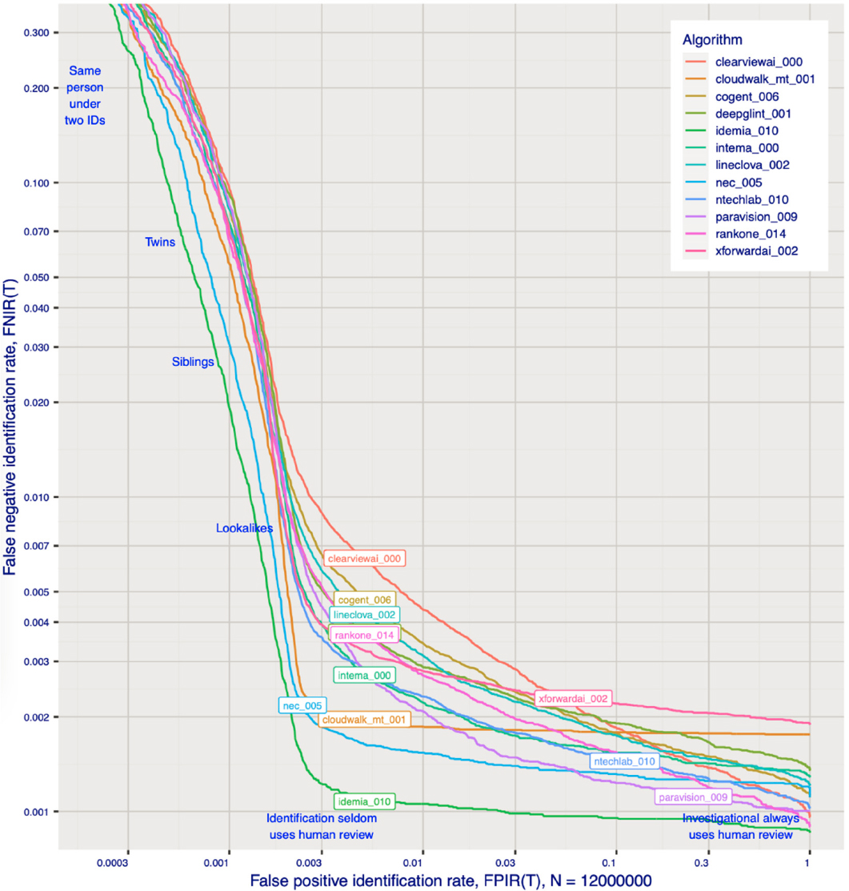

#  Análise Ética do Reconhecimento Facial

**Autor:** Matheus Braga  

---

## 1. Introdução  
O reconhecimento facial tem se espalhado em setores sensíveis como segurança e acesso, mas traz dilemas essenciais quando consideramos **privacidade**, **justiça** e **viés algorítmico**.

---

## 2. Aplicação do Framework Ético  

### 2.1 Viés e Justiça  
- Um estudo clássico mostrou taxas de erro de **34,7 % para mulheres negras**, enquanto mulheres brancas registravam 7 % e homens brancos menos de 1 % :contentReference[oaicite:2]{index=2}.  
- Um trabalho com MIT revela que mulheres negras eram mal identificadas em até **35 % das vezes**, contra apenas **1 % dos homens brancos** :contentReference[oaicite:3]{index=3}.  
- A abordagem mais justa nos sistemas de maior desempenho apresentou falso-negativos de **≤ 0,49 % para negras** e **≤ 0,85 % para homens brancos** :contentReference[oaicite:4]{index=4}.  
- Mesmo com imagens de alta qualidade, mulheres negras têm mais falsos positivos e mulheres em geral têm falsos negativos mais elevados do que homens :contentReference[oaicite:5]{index=5}.

**👉 Conclusão:** Há desigualdade clara nos erros. Pessoas negras e mulheres sofrem desvantagem significativa.

---

### 2.2 Transparência e Explicabilidade  
- Estudos demonstram grandes variações de desempenho entre algoritmos, com os melhores sendo mais justos. Mas não há clara explicação de decisão para o usuário contestar o resultado :contentReference[oaicite:6]{index=6}.

---

### 2.3 Impacto Social e Direitos  
- A **LGPD** protege a privacidade dos dados, mas seu uso em reconhecimento facial coletivo pode infringir esse direito.  
- Casos reais, como entregadores sendo barrados por falhas de verificação, mostram o impacto prático e negligente das desigualdades :contentReference[oaicite:7]{index=7}.

---

### 2.4 Responsabilidade e Governança  
- A falta de transparência sobre quem responde por erros (empresas/governos/desenvolvedores) é grave.  
- Modelos como “**Ethical AI by Design**” precisam incluir: diversidade em dados, auditorias independentes e métricas de justiça, como disparate impact :contentReference[oaicite:8]{index=8}.

---

## 3. Posicionamento Profissional  
O reconhecimento facial **não deve ser banido automaticamente**, mas precisa ser **redesenhado com foco em equidade, responsabilidade e supervisão normativa**.

---

## 4. Recomendações  
1. **Auditorias independentes de viés** obrigatórias antes da adoção.  
2. **Clareza total**: explicar critérios usados e oferecer canais de contestação.  
3. **Uso restrito e regulamentado**, respeitando a LGPD e com supervisão judicial em segurança pública.

---

## 5. Conclusão  
Tensão entre inovação e justiça não pode ser ignorada. O reconhecimento facial, se mal implementado, reforça desigualdades e viola direitos sociais. Ética e governança devem ser a base do design em IA — para que a tecnologia seja transformadora, e não opressora.

---

#  Dados Reais — Gráfico Histórico de Erros

Esse gráfico do NIST confirma: algoritmos estão melhorando, mas o problema de viés persiste se não houver diversidade consciente na modelagem.
